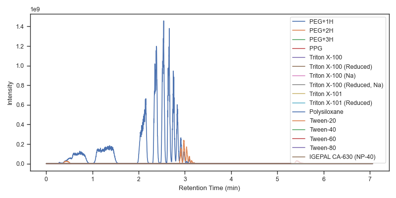

# :skunk: mzsniffer :nose:

Detect polymer contaminants in mass spectra.

## Introduction
Mzsniffer is a command line application to quickly detect common polymer contaminants in mass spectrometry experiments.
It is pretty dumb - mzsniffer merely extracts the intensities for common polymer precursors from the MS1 spectra of one or more mzML files.
What it lacks in sophistication, mzsniffer makes up for in speed :rocket:.
It only takes a few seconds to analyze most mzML files!

By default, mzsniffer logs the percentage of the total ion current that each polymer comprises.
However, more detailed information can be saved to either JSON or as a pickled Python object using stdout (see the examples below).

Give it a try and let me know how it goes!

## Installation
### Install from bioconda
Coming soon!

### Manually download the latest release
The latest release can be manually downloaded from GitHub:
1. Navigate to the [Releases](https://github.com/wfondrie/mzsniffer/releases/tag/latest) page.
2. Download the correct binary for your system.
3. Run mzsniffer (from the directory to which it was downloaded):
``` sh
mzsniffer --help
```

## Usage

mzsniffer is a command line program and can be run in your favorite shell:
``` sh
 $ mzsniffer --help
 Usage: mzsniffer [OPTIONS] [mzml_paths]...

🦨 mzsniffer 👃 - Detect polymer conminants in mass spectra.

Written by William E. Fondrie <fondriew@gmail.com>
Version 0.1.0

Arguments:
  [mzml_paths]...  The mzML file(s) to analyze.

Options:
  -t, --tolerance <tol>  The precursor mass tolerance. [default: 10]
  -d, --use-da           Use Da instead of ppm as the precursor mass tolerance unit.
  -f, --format <format>  Specify an output format to be sent to stdout. Must be one of 'json' or 'pickle'.
  -h, --help             Print help
  -V, --version          Print version
```

When provided one or more mzML files, mzsniffer will look for common polymer contaminants:

``` sh
$ mzsniffer data/MSV000081544.20170728_MS1_17k_plasmaspikedPEG_3.mzML
[INFO ] Reading data/MSV000081544.20170728_MS1_17k_plasmaspikedPEG_3.mzML...
[INFO ]  - Read time:  1s
[INFO ] Extracting MS1 signals of polymer contaminants...
[INFO ]  - Extraction time:  1s
[INFO ] ++++++++++++++++++++++++++++++++++++
[INFO ] Polymer                         %TIC
[INFO ] ++++++++++++++++++++++++++++++++++++
[INFO ] PEG+1H                       14.2581
[INFO ] PEG+2H                        0.6921
[INFO ] PEG+3H                        0.0013
[INFO ] PPG                           0.0071
[INFO ] Triton X-100                  0.0033
[INFO ] Triton X-100 (Reduced)        0.0074
[INFO ] Triton X-100 (Na)             0.0010
[INFO ] Triton X-100 (Reduced, Na)    0.0023
[INFO ] Triton X-101                  0.0017
[INFO ] Triton X-101 (Reduced)        0.0013
[INFO ] Polysiloxane                  0.0029
[INFO ] Tween-20                      0.0005
[INFO ] Tween-40                      0.0013
[INFO ] Tween-60                      0.1121
[INFO ] Tween-80                      0.0027
[INFO ] IGEPAL CA-630 (NP-40)         0.0017
[INFO ] ++++++++++++++++++++++++++++++++++++
[INFO ]
[INFO ] DONE!
[INFO ] Elapsed time:  3s
```

Using the `--format` argument, you can save more detailed results to as JSON or a pickled Python object.
Below, we pipe is to a [short Python script](scripts/example_plot.py) to plot the summed extracted ion chromatogram for each contaminant:

``` sh
$ mzsniffer data/MSV000081544.20170728_MS1_17k_plasmaspikedPEG_3.mzML --format json | scripts/example_plot.py
```



## Attributions

The mzML parsing code in mzsniffer was directly adapted from [Sage](https://github.com/lazear/sage) by @lazear... dragons :dragon: and all.

Most of the polymers were adapted from [EncyclopeDIA](https://bitbucket.org/searleb/encyclopedia/wiki/Home) by @briansearle.
